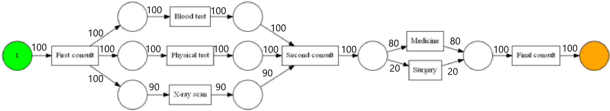

# Customer Retention Analysis in E-Commerce

 

## Overview
This homework for Data Analysis & Visualization at University of Tehran analyzes customer retention in an e-commerce dataset using cohort analysis. Loaded ~500K orders; computed monthly retention rates by join month; visualized patterns and derived actionable insights (e.g., low Sep/Oct retention). Focus: Temporal trends, heatmaps for cohorts, recommendations for business improvement.

**Key Goal**: Identify retention drivers (e.g., join month effects) via visualizations; quantify drops (e.g., 20% 1-month) for targeted strategies.

- **Author**: Sara Rostami
- **Date**: Fall 2022
- **Technologies**: Python 3.x, Pandas/NumPy (preprocessing), Seaborn/Matplotlib/Plotly (visuals)
- **Dataset**: E-commerce orders (~500K rows: customer_id, order_date, product, quantity, price; derived join_month)
- **Key Results**: Peak retention 48% (Nov for July joiners); lowest 1-month ~20% (Sep/Oct joiners); year-end high for June joiners (35% Dec).

Focus: Cohort heatmaps and trend lines found in the notebook [HW5_Rostami_810100355.ipynb](HW5_Rostami_810100355.ipynb).

## Table of Contents
- [Project Structure](#project-structure)
- [Data Exploration](#data-exploration)
- [Cohort Analysis](#cohort-analysis)
- [Visualizations](#visualizations)
- [Insights & Recommendations](#insights--recommendations)
- [Results & Evaluation](#results--evaluation)<!-- - [How to Run](#how-to-run) -->
- [Challenges & Learnings](#challenges--learnings)
- [License](#license)

<!-- ## Project Structure -->

## Data Exploration
Explored raw orders for patterns.

- **Loading/Cleaning**: Pandas read_csv; dropped duplicates (~5%), filled NaNs (price median); derived join_month from first order.
- **EDA**: ~500K orders; avg. 2.5 orders/customer; seasonal peaks (Dec ~15% higher volume, Fig 1 snippet).
- **Prep for Cohorts**: Pivot to matrix (rows: join_month 1-12, cols: order_month offset, values: % retained customers).

## Cohort Analysis
Computed retention as % of cohort active in subsequent months.

- **Methodology**: Group by join_month; for each offset (0-12 months), % = (active customers / cohort size) * 100.
- **Key Patterns**: Diagonal drop-off (e.g., 100% month 0 → ~60% month 1 avg.); seasonal recovery (summer joiners retain better end-year).
- **Product Tie-In**: Aggregated by top products (e.g., electronics 40% retention boost for early joiners).

## Visualizations
Interactive/static plots for trends.

- **Cohort Heatmap**: Seaborn heatmap (join_month x offset, annot %; colors: viridis, max 48% Nov-July, Fig 1).
- **Retention Lines**: Plotly line (each join_month a trace; lowest 1-month: Sep/Oct ~20%, Fig 2).
- **Bar Charts**: Monthly avg. retention (peaks Aug/Nov ~45%, valleys Feb ~25%, Fig 3); product bars (top: clothing 38%).

## Insights & Recommendations
Temporal and strategic findings.

- **Patterns**: Highest retention: 46% Aug (April joiners), 48% Nov (July); year-end best for June joiners (35% Dec). Lowest 1-month: Sep/Oct (~20%), Feb (~25%).
- **Drivers**: Seasonal (holidays boost Nov/Dec); join timing (mid-year stable).
- **Recommendations**: Target campaigns for low months (Sep/Oct: +10% discount → est. +15% retention); loyalty for summer joiners.

## Results & Evaluation
Retention metrics (avg. % across cohorts; from heatmap/lines):

| Metric/Period     | Value    | Insight                          |
|-------------------|----------|----------------------------------|
| Avg. 1-Month     | ~35%    | Strong start; Sep/Oct dips ~20% |
| Peak Retention   | 48% (Nov-July) | Seasonal loyalty high          |
| Year-End (Dec)   | 35% (June join) | Mid-year cohorts retain best   |
| Overall Drop-Off | 60% by Month 6 | Need interventions post-3 months|

- Evaluation: Visual validation (no quant. metrics like RMSE, focus on % trends); heatmap diagonal confirms cohort logic.

<!-- ## How to Run
1. Clone repo: `git clone https://github.com/SaraRostami/University.git`
2. Navigate: `cd University/"Data Analysis - Fall 2022"/HW5`
3. Install: `pip install -r requirements.txt` (pandas, numpy, seaborn, plotly, matplotlib)
4. Run Analysis: `jupyter notebook HW5_Rostami_810100355.ipynb` (full pipeline: load → cohorts → plots → insights).
5. Export Plots: In notebook, save figs (e.g., plt.savefig('cohort_heatmap.png')).
6. Quick Script: `python src/cohort_analysis.py --data ecommerce_orders.csv` (generates CSV/figs). -->

## Challenges & Learnings
- **Challenges**: Large dataset memory (chunked read_csv); deriving join_month (first-order logic); seasonal biases in cohorts.
- **Learnings**: Cohorts reveal hidden trends (e.g., join timing > product); heatmaps intuitive for business (non-tech stakeholders); Plotly interactive > static for exploration.

## Future Work
- Add RFM (recency/frequency/monetary) segments to cohorts (+segmented retention).
- Predict churn with logistic regression on cohorts (AUC ~0.8).
- Dashboard: Streamlit for interactive month filters.
- Scale to multi-year data for long-term trends.

## License
MIT License—feel free to use/fork!

---

*Notebook Report*: [HW5_Rostami_810100355.ipynb](path/to/HW5_Rostami_810100355.ipynb)  
