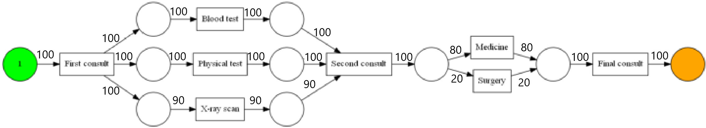

# Customer Retention Cohort Analysis & Process Mining



## Overview
Homework 5 of Data Analysis & Visualization (University of Tehran), on business analytics, in two parts:

1. **Customer retention analysis**: 20,000 e-commerce transactions from 2017. We built monthly acquisition cohorts and a cohort-retention heatmap, and compared retention across sales channels (online vs. offline) and product sizes.
2. **Process mining**: an event log of 690 hospital treatment steps for 100 patients. We reconstructed the treatment process (who does what, in which order and how often) and measured the time between steps.

- **Author**: Sara Rostami
- **Date**: Dec 2022
- **Technologies**: Python, pandas, NumPy, Matplotlib, Seaborn, Plotly
- **Data**: [`transaction.csv`](transaction.csv) (20,000 transactions, 3,494 customers, 101 products) · [`PatientTreatment.csv`](PatientTreatment.csv) (690 events, 100 patients)
- **Key Results**:
  - Only **36% of customers buy again in the month after their first purchase**. Retention then stays flat, at roughly 35–40% per month, for every cohort.
  - The **January cohort is the largest by far**, with 1,354 of 3,494 customers (39%).
  - **The September and October cohorts have the weakest first-month retention (30%).** The **June cohort ends the year strongest** (43% active in December), and the **August cohort weakest** (25%).
  - Online and offline customers retain almost identically. Buyers of small or large products rarely buy that size again (5–8% after one month, compared with 25% for medium).

## Table of Contents
- [Project Structure](#project-structure)
- [Part 1: Customer Retention](#part-1-customer-retention)
- [Part 2: Process Mining](#part-2-process-mining)
- [Recommendations](#recommendations)
- [Limitations](#limitations)

## Project Structure
```
HW5/
├── HW5_Rostami_810100355.ipynb   # Full analysis (process mining + retention)
├── transaction.csv               # E-commerce transactions (2017)
├── PatientTreatment.csv          # Hospital treatment event log
├── diagram.png                   # Process diagram annotated with patient counts
└── DA_HW5.pdf                    # Assignment description (Persian)
```

## Part 1: Customer Retention
**Method**
- Each customer's **cohort** is the month of their first purchase.
- For each cohort and each later month, count the unique customers who bought something, then divide by the cohort size. This gives the retention matrix, shown as a heatmap with cohort sizes alongside.
- We also computed overall retention curves by months since first purchase, split by `online_order` and by `product_size`.

**Cohort retention (% of each cohort active N months after joining)**

| Cohort | Size | +1 | +2 | +3 | +4 | +5 | +6 |
|---|---|---|---|---|---|---|---|
| Jan | 1,354 | 36% | 38% | 38% | 37% | 36% | 38% |
| Feb | 800 | 41% | 37% | 39% | 36% | 37% | 38% |
| Mar | 484 | 35% | 36% | 35% | 38% | 38% | 36% |
| Apr | 336 | 33% | 36% | **46%** | 43% | 36% | 42% |
| May | 210 | 40% | 39% | 41% | 34% | 35% | 35% |
| Jun | 122 | 37% | 36% | 39% | 38% | 38% | 43% |
| Jul | 77 | 34% | 38% | 42% | **48%** | 31% | — |
| Aug | 51 | 37% | 41% | 33% | 25% | — | — |
| Sep | 23 | 30% | 30% | 39% | — | — | — |
| Oct | 20 | 30% | 40% | — | — | — | — |

**Findings**
- **The first month is the main drop-off.** About 64% of new customers don't return the following month. Those who do return keep buying at a steady rate for the rest of the year.
- **Acquisition is front-loaded.** January to March bring in 75% of all customers, and new-customer numbers shrink every month after that.
- **Channel makes no difference.** First-month retention is 19.2% for online and 18.9% for offline customers, and the two curves overlap for the whole year.
- **Product size matters, but partly because of base rates.** One month after their first purchase of a given size, 24.9% of medium-product buyers buy medium again, compared with 8.3% for large and 5.5% for small. Medium products make up 65% of all transactions, though, so repeat buyers are simply more likely to pick medium.

## Part 2: Process Mining
- Every patient follows **First consult → (blood test, physical test, X-ray) → Second consult → (medicine or surgery) → Final consult**.
- **Coverage**: blood tests, physical tests and all three consults happen for 100% of patients. X-rays happen for 90%, medicine for 80% and surgery for 20%.
- **Roles recovered from the log**:
  - Dr. Alex, Dr. Charlie, Dr. Quinn and Dr. Rudy are surgeons.
  - Nurses Corey and Jesse run the physical tests, and Teams 1 and 2 run the X-rays.
  - Dr. Anna is the busiest resource, with 158 events across all three consult types.
- **Time from second consult to surgery**: mean 5,655 minutes (≈ 3.9 days), SD 2,743 minutes.

## Recommendations
- **Put retention effort into the first 30 days**, for example onboarding offers or a follow-up after the first purchase. That is where most customers are lost.
- **Look into the September/October cohorts** (30% first-month retention). Check what changed in those months, such as campaigns, stock or delivery.
- **Look into small and large products**: their pricing, availability and returns, since their buyers rarely come back for the same size.

## Limitations
- Later cohorts are small (Sep: 23, Oct: 20, Nov: 13, Dec: 4 customers), so their percentages are noisy. A single customer moves the Oct cohort by 5 percentage points.
- The data covers one year, so the overall retention curve is right-censored. Its decline after month 8 mostly reflects that later cohorts haven't been observed for long enough. The cohort heatmap isn't affected by this.
