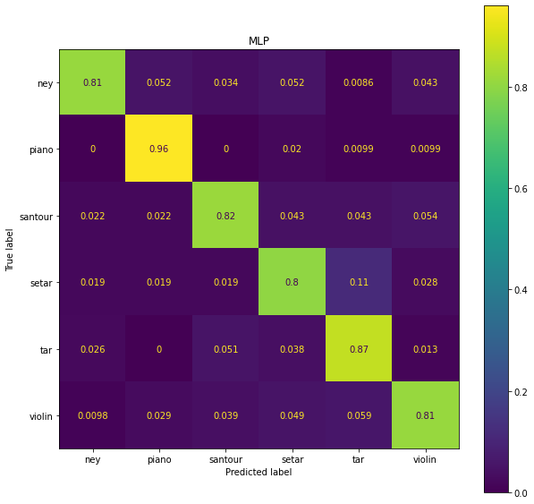

# Musical Instrument Classification from Audio (Persian & Western Instruments)

## Overview
The final project for Machine Learning (University of Tehran, Fall 2021): an end-to-end ML project, starting from collecting the data. The task is to recognise which of **six solo instruments** is playing in a music recording. Four are Persian (**tar, setar, santour, ney**) and two are Western (**piano, violin**).

1. **Data collection**: the class collected about 1,500 solo-instrument MP3 recordings, around 250 per instrument.
2. **Feature extraction**: each recording's first 30 seconds is summarised with librosa as 20 mean MFCCs plus a zero-crossing count.
3. **Classification**: we compared logistic regression, k-NN, Gaussian Naive Bayes, SVM and an MLP, with hyperparameters tuned by grid search or validation curves.
4. **Clustering**: we tested whether instruments separate without labels, using k-means, k-medoids, hierarchical clustering, mean-shift and DBSCAN.

- **Team Members**: Sara Rostami, Keyhan Raeiti, Anousheh Saadati, Soheil Sedghi
- **Date**: Fall 2021
- **Technologies**: Python, librosa, pandas, NumPy, scikit-learn, scikit-learn-extra, Matplotlib
- **Key Results**:
  - **MLP: 84% test accuracy** (macro F1 0.84) across 6 instruments. Chance is 17%.
  - **SVM (RBF): 81%** and logistic regression: 80%.
  - Piano is the easiest instrument to recognise (96–97% recall). The most common error is **setar predicted as tar** (11% of setar recordings). The two are closely related Persian lutes.
  - Unsupervised clustering reaches only **0.35 purity**, so the summary features don't separate instruments without labels.

## Table of Contents
- [Project Structure](#project-structure)
- [Data & Features](#data--features)
- [Classification](#classification)
- [Clustering](#clustering)
- [Limitations & Future Work](#limitations--future-work)

## Project Structure
```
Final Project/
├── feature extraction.ipynb      # MP3 → 30 s clip → 20 MFCC means + zero-crossing count (librosa)
├── FinalDataSet.csv              # Extracted features: 1,490 recordings × 21 features + label
├── calssifications.ipynb         # Logistic regression, k-NN, Naive Bayes, SVM, MLP
├── clustering.ipynb              # k-means, k-medoids, hierarchical, mean-shift, DBSCAN
├── mlp_confusion_matrix.png      # Normalised confusion matrix of the best model (from the notebook)
├── FinalProjectDescription.pdf   # Project description (Persian)
└── Final_Project_Report.pdf      # Full report (Persian)
```

## Data & Features
- **Recordings**: 1,508 MP3s (128 kbps) of solo performances:

  | Instrument | Recordings |
  |---|---|
  | ney | 261 |
  | piano | 246 |
  | santour | 246 |
  | setar | 270 |
  | tar | 242 |
  | violin | 263 |

  Features were extracted for 1,490 of them.
- **Features** (computed with `librosa` at 44.1 kHz on the first 30 s of each recording):
  - **20 MFCCs**, averaged over time. They capture each instrument's timbre.
  - **Zero-crossing count**, a rough measure of noisiness and pitch.
- **Split**: 60% train (894), 20% validation (298), 20% test (298), with features standardised on the training set.

## Classification
| Model | Tuning | Accuracy | Macro F1 |
|---|---|---|---|
| **MLP** (256-128-64-32, tanh, Adam) | 5-fold grid search over architecture, activation, solver, regularisation | **84%** | **0.84** |
| SVM (RBF, C = 1000, γ = 1e-3) | 5-fold grid search over RBF / linear / polynomial kernels | 81% | 0.81 |
| Logistic regression (one-vs-rest) | — | 80% | 0.80 |
| k-NN (k = 4, distance-weighted) | k chosen on the validation set | 76% | 0.76 |
| Gaussian Naive Bayes | — | 66% | 0.64 |

Accuracy is measured on the 596 recordings held out from training (validation + test). The one exception is k-NN, which was tuned on the validation half and is reported on the 298-recording test half.

**Per-instrument recall (MLP)**: piano 96%, tar 87%, santour 82%, violin 81%, ney 81%, setar 80%.



## Clustering
All five algorithms were run with k = 1–6 clusters and scored by **purity**: the fraction of recordings that belong to their cluster's majority instrument. If everything is in one cluster, purity is 0.18.

| Algorithm | Purity (k = 6) |
|---|---|
| k-medoids | **0.354** |
| k-means | 0.353 |
| Hierarchical (cosine distance, average linkage) | 0.306 |
| Mean-shift | 0.185 |
| DBSCAN | Puts almost everything in one cluster |

Clustering finds some structure (piano recordings mostly form their own cluster), but it doesn't recover the six instruments. Instrument identity is clearly in the features, since the classifiers reach 84%. Without labels, though, other variation such as recording conditions and loudness dominates.

## Limitations & Future Work
- **Features**: averaging MFCCs over 30 s throws away temporal information. Adding MFCC variances and deltas, spectral contrast and chroma, or using a CNN on log-mel spectrograms, would likely help most with the setar/tar confusion.
- **Splits**: the split is by recording, not by performer or album, so similar recordings can land in both training and test sets. A grouped split would give a more honest estimate.
- **Clustering**: k-means and k-medoids were run on unscaled features, where the zero-crossing count (on the order of 10⁴) outweighs the MFCCs. Standardising the features first would make the comparison fairer.
