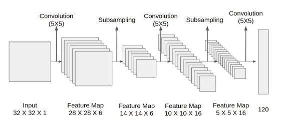

# Fraud Detection, Face Liveness Detection and Persian OCR with Deep Networks



## Overview
An extra assignment for Neural Networks & Deep Learning (University of Tehran) with three independent tasks:

1. **Credit-card fraud detection**: replicates the pipeline from *Credit Card Fraud Detection Using Autoencoder Neural Network*, which combines SMOTE oversampling, a denoising autoencoder and a fully-connected classifier on a dataset where 0.17% of transactions are fraud.
2. **Face liveness detection**: a small CNN liveness classifier, plus a real-time blink-detection demo that uses an eye-state CNN.
3. **Persian handwritten digit recognition (OCR)**: a deep CNN on the HODA dataset, trained with three optimisers for comparison.

- **Team Members**: Sara Rostami, Amin Shahcheraghi
- **Date**: Dec 2022
- **Technologies**: Python, TensorFlow/Keras, scikit-learn, imbalanced-learn (SMOTE), OpenCV (Haar cascades), Matplotlib (trained on Google Colab)
- **Key Results**:
  - **Fraud detection**: catches **87% of fraudulent transactions** (128 of 147 in the test set) at 11% precision. The same classifier trained without SMOTE and denoising catches 2%.
  - **Liveness detection**: **95.5% validation accuracy** with a 20.7K-parameter CNN.
  - **OCR**: **99.48% test accuracy** on 20,000 HODA digits (SGD with momentum) and 99.44% with Adam.

## Table of Contents
- [Project Structure](#project-structure)
- [Q1: Credit-Card Fraud Detection](#q1-credit-card-fraud-detection)
- [Q2: Face Liveness Detection](#q2-face-liveness-detection)
- [Q3: Persian Handwritten Digit Recognition](#q3-persian-handwritten-digit-recognition)
- [Results](#results)
- [Limitations & Future Work](#limitations--future-work)
- [References](#references)

## Project Structure
```
Extra Homework/
├── Q1/
│   ├── Q1.ipynb                                      # SMOTE + denoising autoencoder + classifier
│   └── Credit Card Fraud Detection Using Autoencoders.pdf   # Reference paper
├── Q2/
│   ├── code part 1.ipynb                             # CNN liveness classifier
│   ├── liveness detection code part 2.zip            # Blink-detection demo (adapted from Guarouba/face_rec)
│   ├── Dataset_2.zip                                 # Open/closed eye images for the eye-state CNN
│   ├── Haar_cascade.zip                              # OpenCV face/eye cascades
│   └── face_liveliness_detection.MOV                 # Demo recording
├── Q3/
│   ├── ex3.ipynb                                     # CNN on HODA with SGD+momentum / Adam / Adadelta
│   └── HODA.zip                                      # HODA Persian digit dataset (.cdb)
├── Extra HW.pdf                                      # Assignment description (Persian)
└── NNDL_Extra_Report.pdf                             # Full report (Persian)
```

## Q1: Credit-Card Fraud Detection
Data: the [Kaggle credit-card fraud dataset](https://www.kaggle.com/datasets/mlg-ulb/creditcardfraud), with 284,807 transactions, 0.17% of them fraud.

1. **Preprocessing**: drop `Time` and min-max scale `Amount`. Split 70/30 into 199,364 training transactions (345 fraud) and 85,443 test transactions (147 fraud).
2. **SMOTE**: oversample the training set to 398,038 transactions with balanced classes.
3. **Denoising autoencoder**: add Gaussian noise (σ = 0.1) to the inputs. The autoencoder learns to map noisy inputs back to clean ones (29 → 15 → 10 → 15 → 22 → 29, LeakyReLU, MSE loss, Adam, 60 epochs).
4. **Classifier**: a fully-connected network (29 → 22 → 15 → 10 → 5 → 2, LeakyReLU) trained on the denoised features with Adam (lr = 1e-3) for 35 epochs.
5. **Baseline**: the same classifier trained directly on the raw, imbalanced data.

| Model | Fraud recall | Fraud precision | Fraud F1 | Normal recall |
|---|---|---|---|---|
| Baseline (raw, imbalanced data) | 0.02 | 0.00 | 0.00 | 0.76 |
| **SMOTE + denoising AE + classifier** | **0.87** | 0.11 | 0.20 | 0.99 |

The full pipeline finds most of the frauds. It also raises about 1,000 false alarms, roughly 1% of legitimate transactions. That trade-off can work for a first screening stage, but a deployed system would need a second filter or a tuned decision threshold.

## Q2: Face Liveness Detection
**Part 1: CNN liveness classifier** (`code part 1.ipynb`)
- 600 face images at 224×224 (480 train / 120 validation), with two classes.
- Architecture:
  - BatchNorm, then three Conv(3×3) + MaxPool + BatchNorm blocks (8 → 16 → 128 filters) with Dropout 0.1
  - GlobalAveragePooling, then a sigmoid output
  - 20.7K parameters in total
- Training: Adam (lr = 1e-4), binary cross-entropy, 25 epochs. Reaches **95.5% validation accuracy** (89.6% on the training set).

**Part 2: blink-based liveness demo** (`liveness detection code part 2.zip`)
- Haar cascades locate the face and eyes in each frame.
- A small LeNet-style CNN classifies each eye as open or closed (24×24 grayscale). We trained it on `Dataset_2`: 3,783 training and 1,069 validation eye crops.
- A blink (closed for a few frames, then open again) counts as evidence of a live face. This defends against photo attacks.
- The demo code is adapted from [Guarouba/face_rec](https://github.com/Guarouba/face_rec). We retrained the eye-state model for this assignment.

## Q3: Persian Handwritten Digit Recognition
- **Data**: HODA Persian handwritten digits, with 60,000 training and 20,000 test images resized to 40×40.
- **Model**: a deep CNN with 4.66M parameters:
  - Conv blocks of 64 → 128 → 128 → 256 → 256 filters, each with BatchNorm, plus MaxPool and Dropout between blocks
  - Fully-connected head with softmax over 10 digits
- **Optimiser comparison**: 20 epochs, batch size 32, same architecture each time.

| Optimiser | Test accuracy (epoch 20) | Notes |
|---|---|---|
| SGD + momentum (lr = 1e-3, β = 0.9) | **99.48%** | Jumps from ~90% to 99% at epoch 13 |
| Adam (lr = 1e-3) | 99.44% | Converges fastest (99% by epoch 4) |
| Adadelta (Keras default lr = 1e-3) | 73.01% | Still improving steadily; the default learning rate is too small for 20 epochs |

## Results
| Task | Data | Metric | Result |
|---|---|---|---|
| Fraud detection | Credit-card fraud, 85K test transactions | Fraud recall / precision | **87%** / 11% (baseline: 2% recall) |
| Liveness classification | 120 validation face images | Accuracy | **95.5%** |
| Persian digit OCR | HODA, 20K test images | Accuracy | **99.48%** (SGD + momentum), 99.44% (Adam) |

## Limitations & Future Work
- **Fraud detection**:
  - Tune the decision threshold on a separate validation set to trade recall against precision.
  - Report PR-AUC, which handles extreme class imbalance better than accuracy or ROC-AUC.
  - The test set was also used for validation and checkpointing during training. A separate validation split would give an unbiased estimate.
- **Liveness detection**: the dataset of 600 images is small. Evaluating on held-out subjects and adding replay or mask attacks would test generalisation.
- **OCR**: the HODA test set doubled as the validation set, but no model selection was done on it. Every reported number comes from the final epoch.

## References
- Chawla et al. (2002). [*SMOTE: Synthetic Minority Over-sampling Technique*](https://arxiv.org/abs/1106.1813). JAIR.
- *Credit Card Fraud Detection Using Autoencoder Neural Network* (reference paper in [`Q1/`](Q1)).
- LeCun et al. (1998). *Gradient-Based Learning Applied to Document Recognition*. Proc. IEEE (LeNet-5).
- Krizhevsky, Sutskever & Hinton (2012). *ImageNet Classification with Deep Convolutional Neural Networks*. NeurIPS (AlexNet).
- [Guarouba/face_rec](https://github.com/Guarouba/face_rec): eye-blink liveness detection.
- [Assignment description (Extra HW.pdf, Persian)](Extra%20HW.pdf) · [Full report (NNDL_Extra_Report.pdf, Persian)](NNDL_Extra_Report.pdf)
