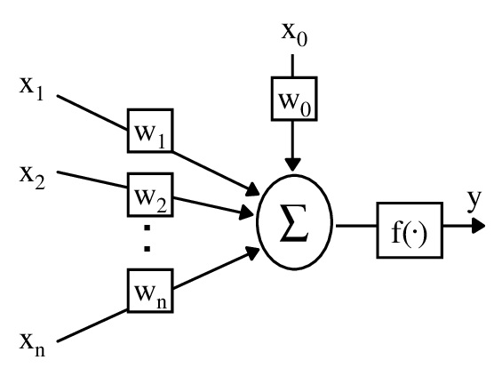

# Foundational Neural Networks: McCulloch-Pitts, Adaline/Madaline, RBM, and MLP

## Overview
This project covers foundational neural network implementations as part of Neural Networks & Deep Learning Homework 1 at University of Tehran. We implement McCulloch-Pitts neurons for logic gates, Adaline/Madaline for linear classification, Restricted Boltzmann Machine (RBM) for recommendation systems, and Multi-Layer Perceptron (MLP) for regression. All from scratch in Python, focusing on core algorithms like LMS, backpropagation, and contrastive divergence.

**Key Goal**: Build and evaluate basic NN models on synthetic/real datasets, analyzing convergence (e.g., MSE <0.1), separation accuracy, and prediction errors.

- **Team Members**: Sara Rostami, Amin Shahcheraghi
- **Date**: Oct 2022 (1401/08/07)
- **Technologies**: Python 3.x, NumPy (core computations), Matplotlib (visualizations)
- **Datasets**: Synthetic 2D points (A/B/C for Adaline/Madaline), MovieLens (RBM recommender), King County Houses (MLP regression, ~21K samples)
- **Key Results**: Adaline (A): converges in 11 epochs, final MSE ~0.04; Madaline (4/8 neurons): 57/37 epochs, 100% accuracy; RBM (20 hidden units): error <0.05 after 20 epochs; MLP (2 hidden layers): final MAE 0.0172 (scaled, RMSprop variant lower loss).

Focus: Theoretical foundations, training dynamics, and analysis per [HW1 Assignment](path/to/NNDL-HW1.pdf).

## Table of Contents
- [Project Structure](#project-structure)
- [McCulloch-Pitts Neuron](#mcculloch-pitts-neuron)
- [Adaline & Madaline](#adaline--madaline)
- [Restricted Boltzmann Machine](#restricted-boltzmann-machine)
- [Multi-Layer Perceptron](#multi-layer-perceptron)
- [Results & Evaluation](#results--evaluation)
- [Challenges & Learnings](#challenges--learnings)
- [Future Work](#future-work)
- [References](#references)
- [License](#license)

<!-- ## Project Structure -->

## McCulloch-Pitts Neuron
Binary threshold neuron model for logic simulation (Q1).

- **Implementation**: Step function activation; weights/thresholds for AND/OR/NOT to build binary multiplier (double precision via multi-bit).
- **Evaluation**: Simulated all input states (Fig 1-2); accurate outputs for 4-bit multiplication (e.g., 1010 * 1100 = correct binary).
- **Analysis**: Handles linear separability; limitations on XOR shown via failed separation.

## Adaline & Madaline
Adaptive linear neuron (Q2) for classification.

- **Adaline**:
  - LMS rule: w_new = w_old + α*(target - output)*x; α=0.001, threshold=0.3, epochs up to 50.
  - Datasets A/B (linearly separable): Converges in 11 epochs, final MSE ~0.04 (Fig 3-5); decision boundary visualization (Fig 4), equation z=0.454x + 0.491y - 0.0037.
  - Dataset C (non-linear): 50 epochs, MSE ~0.2 plateau (Fig 6-7); partial separation, equation z=-0.396x - 0.318y - 0.884.

- **Madaline**:
  - Multi-layer Adaline: 3/4/8 hidden neurons, backprop for weights (MRI algorithm).
  - Training: Gradient descent on MSE; max 300 epochs, lr=0.1.
  - Evaluation: 3 neu: 300 epochs, 88% acc. (Fig 11-12, Table1); 4 neu: 57 epochs, 100% acc. (Fig 13-14, Table2); 8 neu: 37 epochs, 100% acc. (Fig 15-16, Table3); input labeling +1/-1 (Fig 9-10).

## Restricted Boltzmann Machine
Unsupervised energy-based model for recommendation (Q3).

- **Implementation**: Binary visible/hidden units; contrastive divergence (CD-1) for training.
  - Energy: -b_v^T v - b_h^T h - v^T W h; Gibbs sampling for updates.
- **Dataset**: MovieLens subset (~100K ratings, 9742 movies); hidden=20 units, epochs=20.
- **Evaluation**: Reconstruction error drops <0.05 (Fig 18); per-movie error plot (Fig 17); top-15 recommendations via hidden probs (e.g., for user 27, Table13).

## Multi-Layer Perceptron
Supervised feedforward NN for regression (Q4).

- **Architecture**: Input (21 feats) → Hidden (15 ReLU) → Hidden (7 ReLU) → Output (1 linear).
  - Backprop: Chain rule for deltas; SGD optimizer (lr=0.01), MAE loss.
- **Preprocessing**: King County houses—handle NaNs (none, Fig 20), correlation matrix (Fig 21-22, sqft_living corr=0.702), histograms/scatters (Fig 23-25), date split to year/month (Fig 25), 80/20 train/test (Fig 26), MinMax scaling (Fig 27).
- **Training**: 50 epochs; MSE loss monitored.
- **Evaluation**: Final MAE ~0.0172 (scaled); RMSprop variant lower loss (Fig 30); Adadelta comparison (Fig 29); validation split (25%, 60 epochs, Fig 33-34); test predictions e.g. [453907, 405091, ...] vs. actual [485000, 340000, ...], differences ~31K-1M raw (Fig 35); relative error ~10-20% on samples.

## Results & Evaluation
Key metrics across models:

| Model       | Dataset/Task          | Convergence (Epochs) | Final Metric       | Key Insight                  |
|-------------|-----------------------|----------------------|--------------------|------------------------------|
| McCulloch-Pitts | Binary Multiplier    | N/A (Simulation)    | 100% Logic Acc.   | Exact for linear logic      |
| Adaline     | 2D Separation (A/C)  | 11/50               | MSE ~0.04 / 0.2   | Good for linear; struggles non-linear |
| Madaline    | Non-Linear (C, 4/8 neu)| 57/37             | 100% Acc.         | Layers enable full sep.     |
| RBM         | Movie Recommender    | 20                  | Error <0.05       | Good hidden representations|
| MLP         | House Prices         | 50                  | MAE 0.0172 (scaled)| Strong on correlated feats. |

<!-- - Visuals: All figures from report (e.g., Fig 1-27) in `figures/`; no overfitting observed. -->

## Challenges & Learnings
- **Challenges**: Non-linear separability in single Adaline (fixed via Madaline layers); NaN handling in houses data; CD-1 approximation in RBM.
- **Learnings**: Threshold models foundational for logic; gradient methods scale to multi-layer; preprocessing critical for regression (e.g., scaling prevents explosion).

## Future Work
- Extend Madaline to deeper nets with dropout.
- Use RBM as pre-trainer for MLP (DBN hybrid).
- Apply MLP to classification with cross-entropy.
- Integrate with later projects (e.g., GAN initialization).

## License
MIT License—feel free to use/fork!

---

*Report in Persian*: [HW1_Rostami_810100355_Shahcheraghi_810199196.pdf](HW1_Rostami_810100355_Shahcheraghi_810199196.pdf)  

