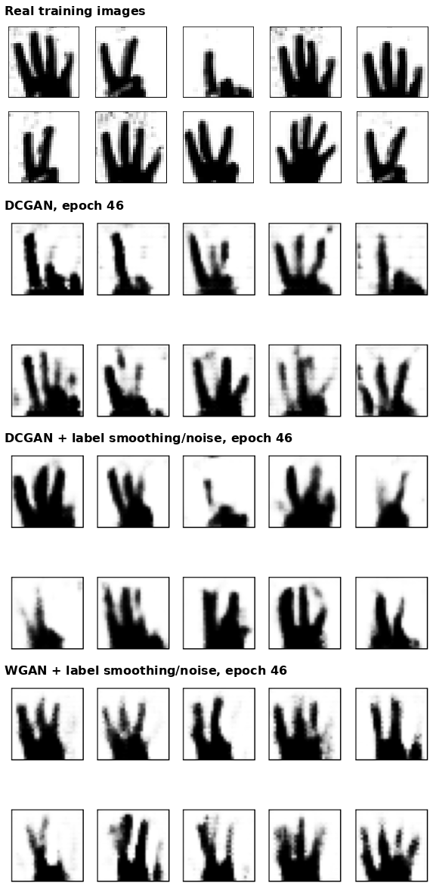

# Generative Adversarial Networks: DCGAN, AC-GAN and WGAN



## Overview
Three GAN variants trained to generate 28×28 images of hand gestures showing the numbers 1–5, done for Homework 6 of Neural Networks & Deep Learning (University of Tehran):

1. **DCGAN**: unconditional image generation with a convolutional generator and discriminator.
2. **AC-GAN**: class-conditional generation. The generator receives a class label, and the discriminator predicts real/fake plus the class.
3. **WGAN**: the DCGAN networks retrained with a Wasserstein-style loss and RMSprop.

We trained each model twice: once as a baseline, and once with **label smoothing and noisy labels** added to stabilise training. Then we compared their loss curves and the samples they generated.

- **Team Members**: Sara Rostami, Amin Shahcheraghi
- **Date**: Fall 2022 semester
- **Technologies**: Python, TensorFlow 2.9 / Keras, OpenCV, scikit-learn, Matplotlib (trained on Google Colab)
- **Dataset**: 1,005 grayscale images of hand gestures for the numbers 1–5, 201 per class ([`Dataset/`](Dataset)). They are stored at 32×32 and resized to 28×28.
- **Key Results**:
  - All three models learn to generate recognisable hand gestures within 50 epochs (see the figure above).
  - The baseline WGAN **stopped learning at epoch ~35**: both losses fell to 0.000 because the critic's sigmoid output saturated.
  - With label smoothing and noisy labels, the WGAN **kept training stably through all 50 epochs**.

## Table of Contents
- [Project Structure](#project-structure)
- [DCGAN](#dcgan)
- [AC-GAN](#ac-gan)
- [WGAN](#wgan)
- [Stabilisation: Label Smoothing & Noisy Labels](#stabilisation-label-smoothing--noisy-labels)
- [Results](#results)
- [How to Run](#how-to-run)
- [Limitations & Future Work](#limitations--future-work)
- [References](#references)

## Project Structure
```
NNDL-HW6/
├── Dataset/                              # 5 folders (Class 1 … Class 5), 201 PNGs each
├── final_DCGAN.ipynb                     # DCGAN baseline
├── improve_of_final_DCGAN.ipynb          # DCGAN + label smoothing / noisy labels
├── AC_DCGAN.ipynb                        # AC-GAN baseline
├── improve_of_AC_DCGAN.ipynb             # AC-GAN + label smoothing / noisy labels
├── wasserstein_DCGAN.ipynb               # WGAN baseline
├── improved_of_wasserstein_DCGAN.ipynb   # WGAN + label smoothing / noisy labels
├── gan_samples.png                       # Real vs. generated samples (from the notebook outputs)
├── dcgan_generator.png                   # DCGAN generator diagram
├── HW6.pdf                               # Assignment description (Persian)
└── NNDL_HW6_Report.pdf                   # Full report with all plots (Persian)
```

## DCGAN
Based on [Radford et al. (2015)](https://arxiv.org/abs/1511.06434).

- **Generator**: noise z ∈ ℝ¹⁰⁰ → Dense(7·7·128) → BatchNorm → Conv2DTranspose(64, 5×5, stride 2, SELU) → BatchNorm → Conv2DTranspose(1, 5×5, stride 2, tanh) → 28×28×1 image.
- **Discriminator**: Conv2D(64, 5×5, stride 2) → LeakyReLU(0.2) → Dropout(0.3) → Conv2D(128, 5×5, stride 2) → LeakyReLU(0.2) → Dropout(0.3) → Dense(1, sigmoid).
- **Training**: binary cross-entropy, Adam, batch size 32, 50 epochs on an 80% training split (804 images) scaled to [−1, 1]. Each step makes one discriminator update and one generator update.

## AC-GAN
Based on [Odena et al. (2017)](https://arxiv.org/abs/1610.09585).

- **Generator**: the class label goes through a 50-d embedding, then Dense(7·7), and becomes an extra 7×7 channel. This channel is concatenated with the projected noise (7×7×384), then upsampled by Conv2DTranspose(192), BatchNorm and ReLU, and finally Conv2DTranspose(1) with tanh.
- **Discriminator**: four Conv2D blocks (32 → 64 → 128 → 256 filters, with LeakyReLU, BatchNorm and Dropout 0.5). It has two output heads:
  - real/fake (sigmoid, binary cross-entropy)
  - class (softmax over 5 classes, sparse categorical cross-entropy)
- **Training**: Adam (lr = 2e-4, β₁ = 0.5), batch size 64, 50 epochs (750 steps). Real and fake half-batches update the discriminator separately.

## WGAN
Based on [Arjovsky et al. (2017)](https://arxiv.org/abs/1701.07875).

- Uses the same generator and discriminator as the DCGAN, trained with the Wasserstein loss `mean(y_true · y_pred)`.
- Targets are ±1 for generated and real images, and the optimiser is RMSprop (lr = 5e-5) as in the original paper.
- **Implementation note**: the critic keeps its sigmoid output, and no weight clipping or gradient penalty is applied, so the Lipschitz constraint is not enforced. This explains the baseline's collapse described below.

## Stabilisation: Label Smoothing & Noisy Labels
Each model was retrained with two changes to the discriminator's targets:
- **Label smoothing**: real-image targets are drawn at random from U(0.9, 1.1) for DCGAN and WGAN, and from U(0.8, 1.1) for AC-GAN, instead of a fixed 1.
- **Noisy labels**: 5% of the discriminator's targets in every batch are flipped at random.

## Results
Final losses are the last values logged in each notebook (a single batch, so they are noisy). GAN losses don't measure sample quality, so read them alongside the samples above and the curves in the report.

| Model | Final D loss | Final G loss | Training behaviour |
|---|---|---|---|
| DCGAN | 0.268 | 2.039 | Recognisable gestures by epoch 46; some noisy pixels in the background |
| DCGAN + smoothing/noise | 0.356 | 2.476 | Similar sample quality; slightly higher D loss, so the discriminator dominates less |
| AC-GAN | 0.688 real / 0.519 fake | 1.709 | Class head learns quickly (class loss < 0.1 on real images); real/fake loss oscillates |
| AC-GAN + smoothing/noise | 0.755 real / 0.632 fake | 1.759 | Similar dynamics; class loss stays low |
| WGAN | 0.000 | 0.000 | **Collapses at epoch ~35**: the sigmoid critic saturates and gradients vanish |
| WGAN + smoothing/noise | −0.036 | 0.547 | **Trains stably through epoch 50**, producing plausible, varied samples |

**Takeaways**
- Label smoothing and noisy labels were enough to stop the WGAN from collapsing, even without a Lipschitz constraint.
- On a small dataset of about 1,000 images, all three models produce plausible hand shapes. The finger count isn't always clear, which is the main motivation for class conditioning (AC-GAN).

## How to Run
The notebooks were written for Google Colab and read images from Google Drive (`mydrive/My Drive/DCGAN/`).
1. Upload [`Dataset/`](Dataset) to your Drive and set the image-loading path in each notebook to point to it.
2. Install the dependencies: `pip install tensorflow opencv-python scikit-learn matplotlib tqdm`.
3. Run a notebook from top to bottom. Each one trains for 50 epochs and displays samples every 5 epochs.

## Limitations & Future Work
- Enforce the WGAN Lipschitz constraint with a gradient penalty (WGAN-GP) and a linear critic output.
- Add quantitative evaluation (FID, or a classifier trained on the real data that scores the generated digits).
- Move the shared data-loading and training code out of the six notebooks into a single module.

## References
- Radford, Metz & Chintala (2015). [*Unsupervised Representation Learning with Deep Convolutional GANs*](https://arxiv.org/abs/1511.06434).
- Odena, Olah & Shlens (2017). [*Conditional Image Synthesis with Auxiliary Classifier GANs*](https://arxiv.org/abs/1610.09585).
- Arjovsky, Chintala & Bottou (2017). [*Wasserstein GAN*](https://arxiv.org/abs/1701.07875).
- [Assignment description (HW6.pdf, Persian)](HW6.pdf) · [Full report (NNDL_HW6_Report.pdf, Persian)](NNDL_HW6_Report.pdf)
