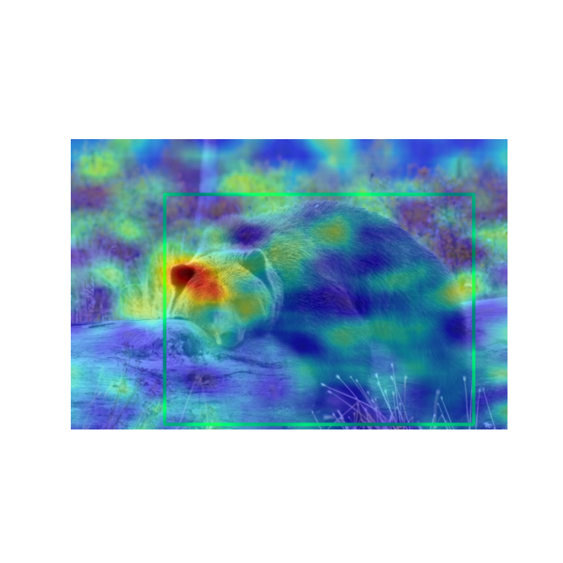
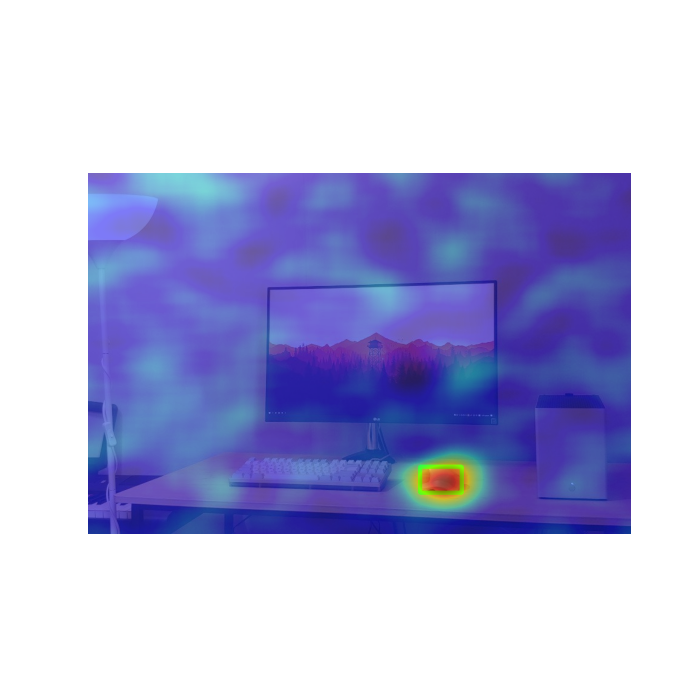
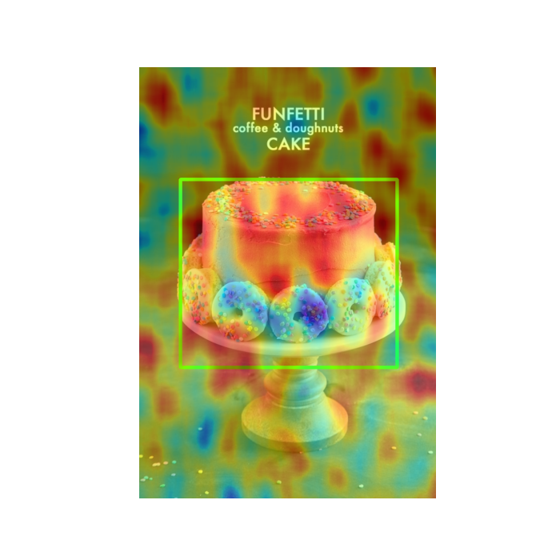
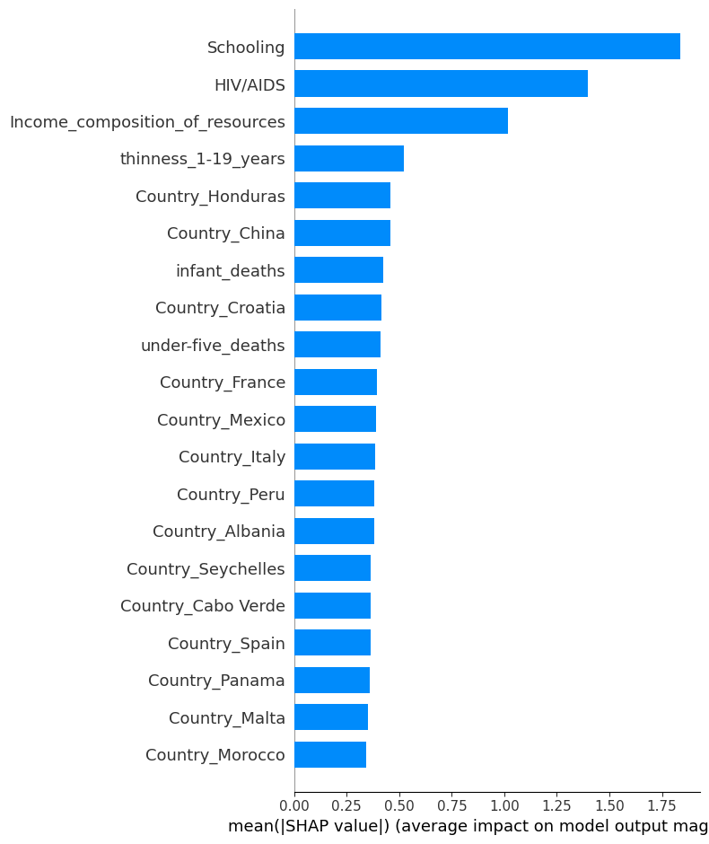
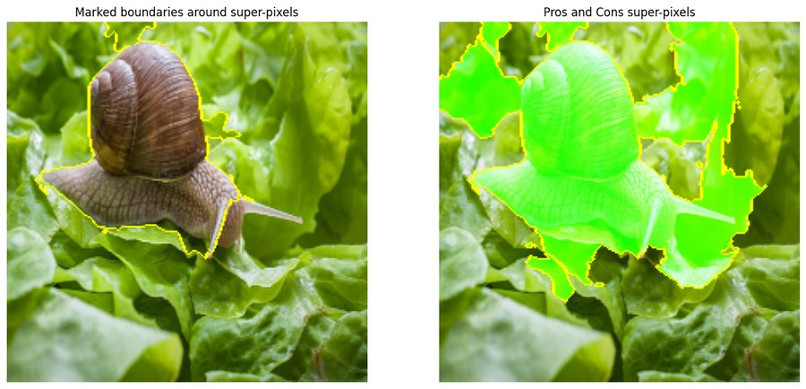

# Explainable AI: SHAP, D-RISE and LIME

<p>
  
  
  
</p>

## Overview
Homework 2 of Trustworthy AI (University of Tehran) applies three explanation methods, each to a different kind of model:

| Method | Type | Model explained |
|---|---|---|
| **SHAP** (Deep SHAP and Kernel SHAP) | Additive feature attribution | MLP regressor predicting national life expectancy from WHO health indicators |
| **D-RISE** | Black-box saliency maps for object detection | Faster R-CNN (ResNet-50-FPN) trained on COCO |
| **LIME** | Local surrogate over superpixels | MobileNetV2 image classifier trained on ImageNet |

- **Author**: Sara Rostami
- **Date**: Spring 2023
- **Technologies**: Python, TensorFlow/Keras, `shap`, `lime`, scikit-image, PyTorch + MMDetection (D-RISE), pandas, scikit-learn
- **Key Results**:
  - The life-expectancy MLP reaches **test R² = 0.956** (RMSE ≈ 2.0 years).
  - **Deep SHAP and Kernel SHAP agree** on the three most important features: **Schooling**, then HIV/AIDS, then income composition of resources.
  - D-RISE saliency concentrates on the detected object, even for a small computer mouse next to a keyboard. LIME shows MobileNetV2's "snail" prediction (94.6%) relies on the shell and body, not the background.

## Table of Contents
- [Project Structure](#project-structure)
- [Q1: SHAP on a Life-Expectancy Regressor](#q1-shap-on-a-life-expectancy-regressor)
- [Q3: D-RISE for Object Detection](#q3-d-rise-for-object-detection)
- [Q4: LIME for Image Classification](#q4-lime-for-image-classification)
- [References](#references)

## Project Structure
```
HW2_Model Interpretability/
├── HW2_TAI_Q1.ipynb            # MLP regressor + Deep SHAP / Kernel SHAP
├── Life Expectancy Data.csv    # WHO life-expectancy dataset (2,938 rows)
├── HW2_TAI_Q3.ipynb            # D-RISE runner (Colab, MMDetection)
├── TAI_Q3_img{1,2,3}.py        # D-RISE script for each input image
├── images_Q3/                  # D-RISE inputs (bear, desk, cake)
├── HW2_TAI_Q4.ipynb            # LIME on MobileNetV2
├── images_Q4/                  # LIME inputs (snail, pizza & wine, truck & traffic light, teddy bear)
├── Images/                     # Saved outputs (D-RISE detections and saliency maps, SHAP and LIME figures)
├── TAI_HW2.pdf                 # Assignment description (Persian)
└── HW2_Rostami_810100355.pdf   # Full report (Persian), including the Q2 paper-reading answers
```
Q2 asked for a written review of *Distilling a Neural Network Into a Soft Decision Tree*. It has no code; the answers are in the report.

## Q1: SHAP on a Life-Expectancy Regressor
**Model**
- **Data**: the WHO life-expectancy dataset, with health, economic and immunisation indicators per country and year.
  - Rows with missing values were dropped, leaving 1,649.
  - `Country` and `Status` were one-hot encoded, giving 153 features (`Year` excluded).
  - Split 90/10 into 1,484 training and 165 test rows, with features standardised.
- **Regressor**: an MLP (64 → 32 → 16 → 1, ReLU) trained with Adam and MSE for 100 epochs. **Train R² = 0.969, test R² = 0.956** (test MSE 4.06, i.e. RMSE ≈ 2.0 years).

**Explanations**
- **Deep SHAP** (`shap.DeepExplainer`, training set as background) and **Kernel SHAP** (`shap.KernelExplainer`, 160 samples per explanation) were computed for all 165 test rows.
- Global importance was compared with summary bar plots. Single predictions were explained with waterfall plots and with force plots for two Asian countries in the test set (Armenia and Turkmenistan).

| Rank | Deep SHAP (mean \|SHAP\|, years) | Kernel SHAP (mean \|SHAP\|, years) |
|---|---|---|
| 1 | **Schooling** (≈ 1.8) | **Schooling** (≈ 1.4) |
| 2 | HIV/AIDS (≈ 1.4) | HIV/AIDS (≈ 0.8) |
| 3 | Income composition of resources (≈ 1.0) | Income composition of resources (≈ 0.55) |



- Both explainers rank the same three features at the top. Education and HIV prevalence dominate the model's predictions, ahead of spending or immunisation rates.
- Many country dummy variables get small but non-zero attributions. This shows the model also memorises country-level offsets, a known risk when the country identity is given as a feature.
- **Note**: the notebook's Kernel SHAP bar plot passes `feature_names=data1.columns`. That list still includes `Year` and `Life_expectancy`, so every label is shifted by two columns: the bar marked "thinness_5-9_years" is actually *Schooling*. The table above uses the correct names. With correct labels, the two explainers agree.

## Q3: D-RISE for Object Detection
- **Detector**: Faster R-CNN R50-FPN (MMDetection, COCO, box mAP 0.384), explained with the [D-RISE](https://arxiv.org/abs/2006.03204) implementation from [hysts/pytorch_D-RISE](https://github.com/hysts/pytorch_D-RISE).
- **How it works**: D-RISE treats the detector as a black box. It applies 500–1,000 random masks (16×16 grid, keep probability 0.5) to the image and weights each mask by how well the masked image's detections still match the target box and class. The weighted masks combine into a saliency map for each detection.
- **Images**:

  | Image | Detections and confidence |
  |---|---|
  | Bear | bear 0.996 |
  | Desk | keyboard 0.996, mouse 0.987, TV 0.875 |
  | Cake stand | three donuts 0.95–0.98, cake 0.79, dining table 0.84 |

- **Findings**:
  - For the bear, keyboard, mouse and each individual donut, the saliency concentrates on the object itself: the bear's head, and the small mouse even though it sits next to the much larger keyboard.
  - For the cake, the saliency spreads broadly across the cake instead of focusing on one part.
  - The cake image also produces a low-confidence (0.55) "donut" box over the top of the cake. Its saliency sits on the sprinkled frosting, which suggests the detector associates that texture with donuts.

## Q4: LIME for Image Classification
- **Classifier**: pre-trained MobileNetV2 (ImageNet), explained with `lime_image`:
  - 800–1,000 perturbed samples per image
  - the 5 most positive superpixels highlighted, plus the 10 strongest positive and negative ("pros and cons") superpixels
  - a heatmap of each superpixel's weight
- **Images and top-1 predictions**:

  | Image | Top prediction | Runner-up |
  |---|---|---|
  | Snail | snail 94.6% | — |
  | Teddy bear | teddy 83.3% | — |
  | Truck with traffic lights | trailer truck 72.1% | fire engine 10.3% |
  | Pizza with red wine | pizza 35.8% | red wine 14.7% |



- For the snail, the supporting superpixels cover the shell and body, so the prediction relies on the object rather than the lettuce background.
- In the multi-object scenes the explanations are less clean. The "pizza" explanation also includes table and background superpixels, and the "trailer truck" explanation includes large areas of sky, road and trees. So the classifier relies on scene context as well as the object, which is what LIME is good at revealing.

## References
- Lundberg & Lee (2017). [*A Unified Approach to Interpreting Model Predictions*](https://arxiv.org/abs/1705.07874). NeurIPS.
- Petsiuk et al. (2021). [*Black-box Explanation of Object Detectors via Saliency Maps*](https://arxiv.org/abs/2006.03204). CVPR.
- Ribeiro, Singh & Guestrin (2016). [*"Why Should I Trust You?" Explaining the Predictions of Any Classifier*](https://arxiv.org/abs/1602.04938). KDD.
- Frosst & Hinton (2017). [*Distilling a Neural Network Into a Soft Decision Tree*](https://arxiv.org/abs/1711.09784).
- [Assignment description (TAI_HW2.pdf, Persian)](TAI_HW2.pdf) · [Full report (HW2_Rostami_810100355.pdf, Persian)](HW2_Rostami_810100355.pdf)
